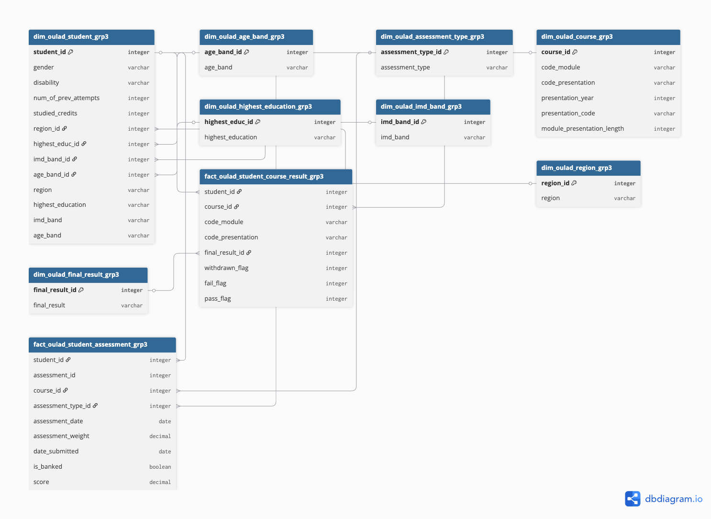

# 📝 Dimensional Modeling Documentation & Presentation (OULAD Project)

## 1. Project Overview

* **Dataset Used:**
  Open University Learning Analytics Dataset (OULAD) [link](https://analyse.kmi.open.ac.uk/open-dataset).

* **Goal of the Exercise:**
  We built an end-to-end pipeline on the OULAD dataset using dlt for ingestion, dbt for cleaning and modeling, and Metabase for BI. The goal was to transform the normalized OLTP schema into a dimensional star schema and practice data engineering skills from ingestion to visualization.


* **Team Setup:**
  Tasks split across ingestion, cleaning, dbt modeling, visualization dashboards, and documentation. 

* **Environment Setup:**
  Local + shared environment. Work executed in **sandbox schema** with dbt jobs for cleaning and transformations.

---

## 2. Architecture & Workflow

* **Pipeline Flow:**
  `raw -> clean -> mart -> visualization (Metabase)`
  ### Ingestion Script
  - This is useful when ingesting multiple CSV files.
  ```
      # dlt/pipeline.py
      import dlt, pandas as pd
      import os
      
      @dlt.resource(name="assessments", write_disposition="replace")
      def assessments():
          ROOT_DIR = os.path.dirname(__file__)
          FILE_PATH = os.path.join(ROOT_DIR, "staging", "oulad", "assessments.csv")
          yield pd.read_csv(FILE_PATH)
      
      @dlt.resource(name="courses", write_disposition="replace")
      def courses():
          ROOT_DIR = os.path.dirname(__file__)
          FILE_PATH = os.path.join(ROOT_DIR, "staging", "oulad", "courses.csv")
          yield pd.read_csv(FILE_PATH)
      
      @dlt.resource(name="student_assessment", write_disposition="replace")
      def student_assessment():
          ROOT_DIR = os.path.dirname(__file__)
          FILE_PATH = os.path.join(ROOT_DIR, "staging", "oulad", "studentAssessment.csv")
          yield pd.read_csv(FILE_PATH)
      
      @dlt.resource(name="student_info", write_disposition="replace")
      def student_info():
          ROOT_DIR = os.path.dirname(__file__)
          FILE_PATH = os.path.join(ROOT_DIR, "staging", "oulad", "studentInfo.csv")
          yield pd.read_csv(FILE_PATH)
      
      @dlt.resource(name="student_registration", write_disposition="replace")
      def student_registration():
          ROOT_DIR = os.path.dirname(__file__)
          FILE_PATH = os.path.join(ROOT_DIR, "staging", "oulad", "studentRegistration.csv")
          yield pd.read_csv(FILE_PATH)
      
      @dlt.resource(name="vle", write_disposition="replace")
      def vle():
          ROOT_DIR = os.path.dirname(__file__)
          FILE_PATH = os.path.join(ROOT_DIR, "staging", "oulad", "vle.csv")
          yield pd.read_csv(FILE_PATH)
      
      # ----------------------------
      # Run pipeline
      # ----------------------------
      
      def run_pipeline():
          """Load each OULAD CSV as a separate table"""
          p = dlt.pipeline(
              pipeline_name="oulad-pipeline",
              destination="clickhouse",
              dataset_name="oulad_grp3",
          )
          print("Fetching and loading each file as separate resource...")
      
          info = p.run([
              assessments(),
              courses(),
              student_assessment(),
              student_info(),
              student_registration(),
              vle()
          ])
      
          print("Records loaded:", info)
      
      if __name__ == "__main__":
          run_pipeline()

  ```
 ## Mart Models
 Read more here -> [Mart SQL Models](https://github.com/cj-a-murillo/ftw-de-bootcamp-grp3/blob/main/act.2-OULAD-data-modeling/Mart-SQL-Models.md)
 
* **Tools Used:**

  * Ingestion: `dlt`
  * Modeling: `dbt`
  * Visualization: `Metabase`

* **Medallion Layers:**

  * **Bronze (Raw):** Direct OULAD source ingestion
  * **Silver (Clean):** Type casting, formatting, removing invalids (`?` -> NULL, boolean conversions, deduplication)
  * **Gold (Mart):** Star schema with fact tables + dimensions

---

## 3. Modeling Process

* **Source Structure (Normalized):**
  7 original raw tables (student info, registration, student assessment, assessments, courses, VLE, student vle, ) 

* **Star Schema Design:**

  Star Schema Design:

    ### Fact Tables:

    - fact_oulad_student_course_result (Student enrollments, final results, pass/fail/withdrawn flags)
    - fact_oulad_student_assessment (Assessment scores, submission dates, assessment weights)


    ### Dimension Tables:

    - dim_oulad_student (Student demographics including gender, disability, previous attempts, studied credits)
    - dim_oulad_course (Course module, presentation, year)
    - dim_oulad_final_result (Pass, Fail, Distinction, Withdrawn)
    - dim_oulad_assessment_type (TMA, CMA, Exam, etc.)
    - dim_oulad_age_band (Age groups)
    - dim_oulad_region (Geographic regions)
    - dim_oulad_highest_education (Education levels)
    - dim_oulad_imd_band (Index of Multiple Deprivation bands)
    
  
  [OULAD ERD dbdiagram.io](https://dbdiagram.io/d/OULAD-Schema-Group-3-68dbd565d2b621e422993150)

* **Challenges / Tradeoffs:**

  * Handling `Withdrawn` and `Fail` categories vs Pass/Distinction
  * Deciding whether to normalize at clean stage or only in mart
  * Potential snowflaking with the initial creation of highly normalized tables vs creating a star schema
  * Prioritizing which features are best for the Fact Table and the normalized Dim tables  

---

## 4. Collaboration & Setup

* **Task Splitting (DBT Clean Stage):**

  * The tables were split among some of the members, while the remaining were tasked to convert and push the finalized tables into dbt format.

* **Shared vs Local Work:**
  Some sync issues and need to align on schema conventions (`stg_oulad_<table>_grp3`).

* **Best Practices Learned:**

  * Use Git for dbt projects
  * Consistent naming conventions
  * Flatten where possible (example gender column -> we directly wrote Male/Female/Others instead of having another table reference)
  * Group debugging sessions helped align schema decisions
  * Prepare the business questions before selecting and planning the schema design.
  * Before pushing the tables, always recheck and validate the number of rows from the raw tables and the sandbox conceptualization tables.

---

## 5. Business Questions & Insights

* **Main Business Question:**
  *What is the average passing percentage per course module and per semester?*

  * Formula: `Passing % = (students passed ÷ students enrolled) × 100`
  * Visualization: **Bar chart** of passing rate per module/semester

* **Sub-Questions:**

  1. Factors influencing completion rate (final_result): disability, region, age band, IMD band, highest education.
  2. Effect of number of semesters registered on completion rate.
  3. Correlation between submission type (`is_banked`) and test scores.
  4. Impact of registration/unregistration dates on performance.

* **Key Insights (early):**

  * `Withdrawn` counts or dropouts are high in high IMD bands and lower-education bands.
  * Curriculum developers can focus on reducing Fail + Withdrawn rather than increasing Pass/Distinction.

---

## 6. Key Learnings

* **Technical:**

  * dbt staging, casting, and building dimension/fact tables
  * SQL joins + aggregation for BI questions
  * Handling missing/boolean conversions

* **Team:**

  * Collaboration in shared schema
  * Documenting transformations
  * Deciding tradeoffs: normalize early vs in mart

* **Real-World Connection:**
  Mimics industry medallion architecture: raw ingestion → clean data → BI-ready mart.
  Handles real-world data from an online university dataset.

---

## 7. Future Improvements

* More testing/validation in dbt
* Optimize large tables (`student_vle` ~10M rows)
* Automate dashboards for different stakeholders (Curriculum Dev, Admission Head)
* Generalize pipeline for other education datasets

---

## 📢 Presentation Tips

* 5–10 min walkthrough with **ERD diagrams + SQL snippets + dashboards**
* Start with **business problem → model → insights**
* Highlight **failures/withdrawals trend** for stakeholder relevance
* End with **learnings + future improvements**


